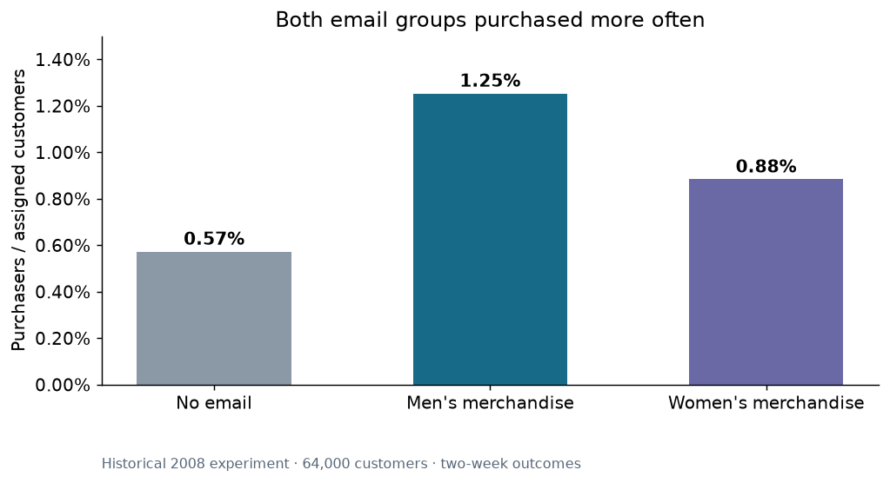

# Email Campaign Analysis

**Did an email cause additional purchases, and would repeating it be worth the cost?**

An independent portfolio project by **Shashank Pabitwar**, analyzing a historical, randomized experiment involving 64,000 customers. The project connects SQL data preparation, statistical inference, Excel business modeling and an interactive report.

## Start with the result

| Assignment | Customers | Purchasers | Purchase conversion | Revenue / customer |
|---|---:|---:|---:|---:|
| No email | 21,306 | 122 | 0.57% | $0.65 |
| Men's merchandise email | 21,307 | 267 | 1.25% | $1.42 |
| Women's merchandise email | 21,387 | 189 | 0.88% | $1.08 |

The men's email increased conversion by **0.68 percentage points** versus no email, equivalent to approximately **6.8 additional purchasers per 1,000 assigned customers**. The women's email increased conversion by **0.31 points**. Both comparisons remain significant after a Holm correction for two tests.

**Decision:** make the men's creative the lead candidate in a fresh experiment. Do not assume a 2008 result will reproduce today. Under illustrative assumptions of 10,000 contacts, 50% contribution margin, $0.05 per email and $500 fixed cost, the men's email yields **$2,849 modeled contribution**. That is a scenario, not observed profit.



## Explore the project

- [Decision memo](docs/decision-memo.md): recommendation, evidence and what would change the decision.
- [Executed notebook](artifacts/Email_Campaign_Analysis.ipynb): readable, editable analysis with code, checks and figures.
- [Excel budget workbook](artifacts/Email_Campaign_Budget.xlsx): XLOOKUP, SUMIFS, input validation, scenario formulas and responsive charts.
- [Methodology](docs/methodology.md): estimands, tests, confidence intervals, diagnostics and limitations.
- [Fresh experiment plan](docs/future-experiment.md): business decision, metrics, sample size and stopping rules.
- [Data dictionary](docs/data-dictionary.md): source fields, reporting tables and denominator rules.
- [Interview guide](docs/interview-guide.md): explain the project and answer the difficult questions.
- [Resume description](docs/resume-description.md): concise, evidence-backed wording.

The public report URL is recorded in `docs/project-links.md` once publication is verified. The website is a published snapshot of this analysis; it is not connected to a live company database.

## What this demonstrates

| Analyst skill | Concrete evidence |
|---|---|
| Business problem definition | Incremental purchase question; explicit recommendation and decision thresholds |
| SQL | Five scripts; CTEs, joins, conditional transformations, aggregation, window ranking, and reconciled reporting grains |
| Data quality | 27 checks across schema, values, denominators and financial reconciliation |
| Experiment analysis | Randomized control, intention-to-treat denominator, Fisher exact tests, multiple-testing correction |
| Statistics | Newcombe intervals, Wilson intervals, 5,000 bootstrap resamples, HC3 regression sensitivity and power planning |
| Excel | Editable budget, XLOOKUP, SUMIFS, validation, break-even calculation and charts |
| Communication | Four report views, short memo, definitions and an honest distinction between evidence and assumptions |
| Reproducibility | Source checksum, fixed random seed, executed notebook, automated tests and version-controlled analysis |

## Reproduce the analysis on macOS, Linux or Windows

Use Python 3.12 or newer in an isolated environment. No Windows virtual machine or paid BI license is needed for the Python analysis or public report.

```bash
python3 -m venv .venv
source .venv/bin/activate
python -m pip install -r requirements.txt
python scripts/fetch_data.py
python scripts/analyze.py
python scripts/prepare_excel_data.py
python -m pytest tests -q
python scripts/create_notebook.py
```

On Windows, activate with `.venv\Scripts\activate` instead. The historical provider serves the raw file over HTTP; the downloader checks the exact reviewed SHA-256 and stops if the bytes differ. It does not disable HTTPS certificate checks.

The Excel deliverable can be opened and edited directly. Its authoring script uses the Codex-provided `@oai/artifact-tool` JavaScript package; regenerating that workbook requires that environment. Core analysis, tests, CSV outputs and the notebook use the Python packages above.

The website's authored analysis is in `web/src/content/dashboard/`. Its included shared Data runtime owns the report controls and export behavior. The validated publication uses that runtime's pinned builder. A source build uses the included package lock and `npm ci && npm run build` in `web` with a compatible Node version; this alternative source build is not the publication path validated here. Preserve `web/AGENTS.md` and runtime integrity metadata.

## Data and attribution

Source: Kevin Hillstrom, [MineThatData E-Mail Analytics and Data Mining Challenge, March 20, 2008](https://blog.minethatdata.com/2008/03/minethatdata-e-mail-analytics-and-data.html). The analysis was prepared in September 2026. Raw and cleaned customer records are excluded from this repository; the downloader retrieves the original source. No explicit redistribution license was found on the source page. Public files contain derived aggregate analysis outputs.

This is a reanalysis, not a claim that I ran the original experiment, worked for the source company, or delivered a realized revenue improvement. Campaign names identify merchandise, not recipient gender. Segment exploration is not a validated targeting model.
