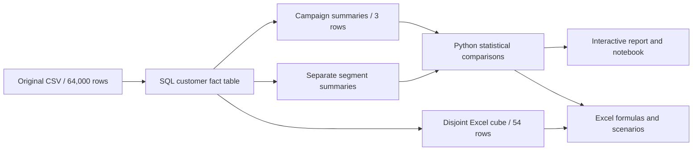

# Data dictionary and model

## Source fields

The original CSV has one customer-profile/outcome row per source record. It has no stable customer ID and no timestamp fields.

| Source field | Meaning and treatment |
|---|---|
| `recency` | Months since last purchase before the campaign; observed 1–12 |
| `history_segment` | Source band of prior spending; preserved |
| `history` | Prior-year spending in USD; pre-treatment covariate |
| `mens`, `womens` | Binary prior merchandise purchase flags; not gender |
| `zip_code` | Broad area category, not a literal postal code; Rural, Urban, source spelling Surburban |
| `newbie` | Source binary flag; detailed qualification rules are unavailable in the description used here |
| `channel` | Prior purchase channel: Web, Phone or Multichannel |
| `segment` | Randomized assignment label: No E-Mail, Mens E-Mail or Womens E-Mail |
| `visit` | Binary visit outcome during follow-up |
| `conversion` | Binary purchase outcome during follow-up |
| `spend` | Follow-up spending in USD, including zero for non-purchasers |

## Local analysis model

`row_id` is an extract-local surrogate key. Derived fields include `campaign`, `prior_channel`, `recency_band`, `area_type`, `purchased`, `visited` and `revenue`. SQL changes readable labels without changing assignment or outcomes.

The reporting cube has one row per campaign × prior channel × recency band × newbie flag. Its customers, purchasers, visitors and revenue are additive. Segment-summary rows are a different structure: each dimension independently covers the population, so adding all dimensions would triple-count it.

## Metric definitions

| Metric | Formula | Important denominator or limit |
|---|---|---|
| Purchase conversion | Purchasers / assigned customers | Includes non-visitors |
| Visit rate | Visitors / assigned customers | Secondary outcome |
| Revenue per customer | Total revenue / assigned customers | Includes zero-spend records |
| Conversion difference | Email conversion − control conversion | Expressed in percentage points after multiplying by 100 |
| Relative conversion lift | Email conversion / control conversion − 1 | Undefined when control rate is zero |
| Incremental revenue | Email revenue per customer − control revenue per customer | Historical mean difference, not current profit |
| Modeled contribution | N × (incremental revenue × margin − send cost) − fixed cost | N, margin and costs are assumptions |

Revenue per purchaser is descriptive and conditions on an outcome potentially changed by email assignment. It is therefore not the primary causal revenue metric. Do not average subgroup rates; sum their numerators and denominators and divide again.

## Provenance

- [Original study description](https://blog.minethatdata.com/2008/03/minethatdata-e-mail-analytics-and-data.html)
- Reviewed raw file SHA-256: `0e5893329d8b93cefecc571777672028290ab69865718020c78c7284f291aece`
- Source period: 2008; two-week follow-up. Exact customer-level assignment dates were not supplied.
- Analysis date: September 17, 2026. It is a fixed historical snapshot, not an automated refresh or live company report.
